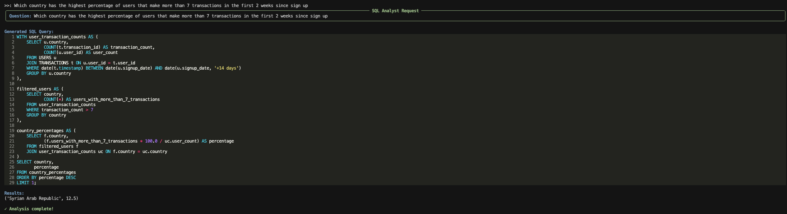
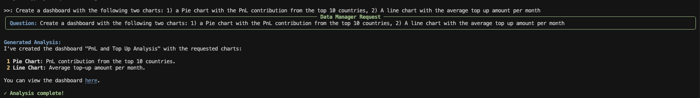
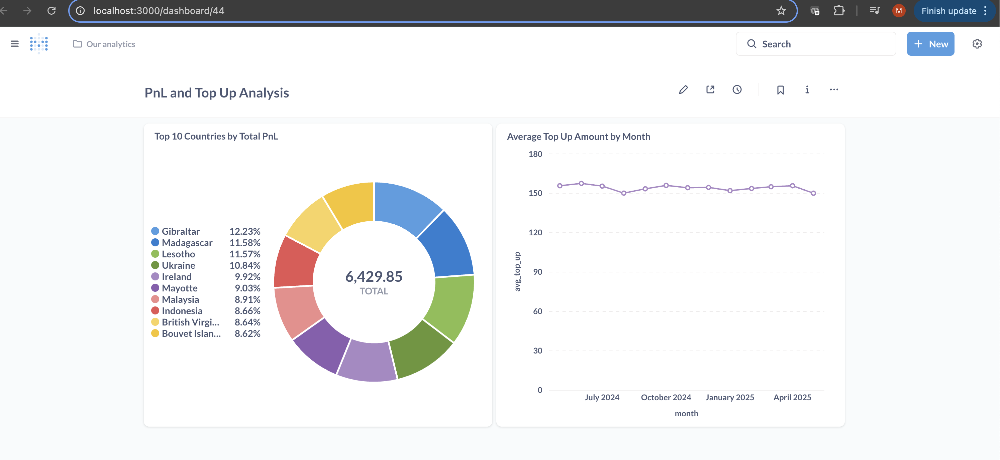
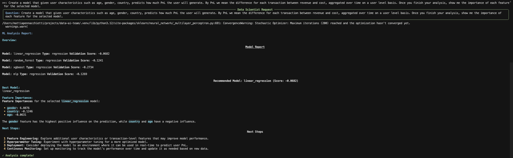

# Data AI CLI

A powerful command-line interface tool that lets you interact with your data using natural language, powered by LLM such as OpenAI's GPT-4o and the OpenAI Agent SDK. Think of it as having a team of data analysts at your fingertips!

## A CLI Data Analyst to chat with your data 

<h1>
  
</h1>

## A CLI Dashboard analyst to visualize your data

<h1>
  
</h1>

<h1>
  
</h1>

## A CLI Data Scientist to model your data

<h1>
  
</h1>

## Features

- 🤖 **AI-Powered Analysis**: Uses GPT-4 to understand and analyze your data through natural language
- 📊 **SQL Generation**: Automatically generates and executes SQL queries based on your questions
- 🎨 **Beautiful CLI Interface**: Rich, colorful output with syntax highlighting and formatted results
- 🔄 **Interactive Experience**: Real-time feedback with loading indicators and clear error messages
- 📝 **Markdown & JSON Support**: Nicely formatted output for both structured and unstructured data

## Prerequisites

- Python 3.12 or higher
- Poetry (Python package manager)
- An OpenAI API key
- SQLite database (or other supported database)

## Installation

1. Clone the repository:
```bash
git clone <your-repo-url>
cd data-ai-team
```

2. Install dependencies using Poetry:
```bash
poetry install
```

3. Create a `.env` file in the project root with your configuration:
```env
# Database
DATABASE_URL=path/to/your/database.sqlite

# LLM Provider
LLM_PROVIDER=openai
OPENAI_API_KEY=your-openai-api-key

# Application settings
DEBUG=true
```

## Usage

### Initialize the Tool

First, initialize the tool with your database path:

```bash
poetry run data-analyst-cli init --db path/to/your/database.sqlite
```

### Ask Questions

Use natural language to ask questions about your data:

```bash
poetry run data-analyst-cli ask_data_analyst "How many transactions were made last month?"
```

The tool will:
1. Display your question in a nice panel
2. Show a loading indicator while analyzing
3. Display the generated SQL query (if any)
4. Show the results in a nicely formatted way
5. Indicate completion with a success message

### Example Questions

Here are some example questions you can ask:

- "What's the total revenue for Q1 2024?"
- "Show me the top 5 customers by transaction volume"
- "What's the average transaction amount per day?"
- "Compare monthly transaction volumes between 2023 and 2024"

## Output Format

The tool provides rich, formatted output including:

- 🟢 Green-bordered panels for questions
- 🔵 Syntax-highlighted SQL queries
- 📊 Formatted JSON results
- 📝 Markdown-formatted text
- ✅ Success/error indicators
- 🎨 Color-coded sections

## Error Handling

The tool provides clear error messages when:
- The OpenAI API key is missing
- The database connection fails
- The query cannot be executed
- The results cannot be processed

## Contributing

Contributions are welcome! Please feel free to submit a Pull Request.

## License

This project is licensed under the MIT License - see the LICENSE file for details.

## Acknowledgments

- Built with [Typer](https://typer.tiangolo.com/) for CLI
- Powered by [OpenAI](https://openai.com/) and [OpenAI Agent SDK](https://github.com/openai/openai-python)
- Styled with [Rich](https://github.com/Textualize/rich)
